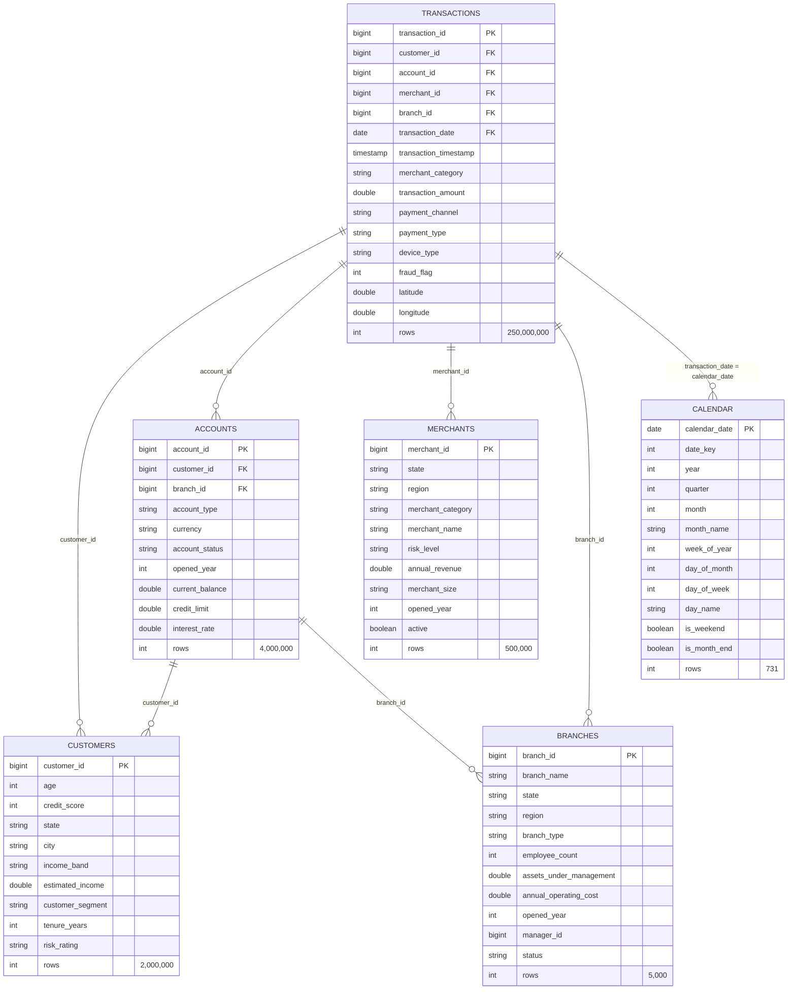

# Spark RAPIDS Qualification Tool Demo

This repository demonstrates how to use the **NVIDIA Spark RAPIDS Qualification Tool** to evaluate Apache Spark workloads for GPU acceleration and compare CPU execution against GPU-accelerated execution using the Spark RAPIDS Accelerator.

The project walks through a complete end-to-end workflow:

1. Generate a synthetic data warehouse
2. Execute representative Spark ETL workloads
3. Analyze the Spark Event Logs with the Spark RAPIDS Qualification Tool
4. Re-run the same workloads with Spark RAPIDS enabled to measure performance improvements

---

# What is Spark RAPIDS?

The **Spark RAPIDS Accelerator** is an open-source plugin for Apache Spark that enables Spark SQL and DataFrame operations to execute on NVIDIA GPUs instead of CPUs.

Rather than requiring applications to be rewritten, Spark RAPIDS replaces many Spark physical operators with GPU-accelerated implementations while preserving the existing Spark APIs. This allows many Spark applications to achieve significant reductions in execution time with minimal code changes.

Before enabling GPU acceleration, it is useful to determine whether an application is actually a good candidate for acceleration. This is the purpose of the **Spark RAPIDS Qualification Tool**.

The Qualification Tool analyzes Spark Event Logs and estimates:

- Whether an application is a good candidate for GPU acceleration
- Which Spark operators are GPU compatible
- Estimated execution time improvements
- Potential GPU utilization
- Recommended GPU cluster sizing

---

# Repository Workflow

The repository is organized into four stages.

## Step 1 — Create the Demo Tables

Run the scripts whose filenames begin with **`1_`**.

These scripts generate the synthetic datasets used throughout the demo, including fact tables and dimension tables that resemble a small analytical data warehouse.

Typical datasets include:

- Customers
- Accounts
- Transactions
- Branches
- Products
- Additional supporting dimension tables

These datasets provide enough scale to exercise Spark joins, aggregations, filters, and shuffle operations.

### Schema

Classic star schema. `transactions` is the fact; the other five are dimensions the ETL joins onto it. Row counts are the values the generators write on a full run.

| Table | Rows | Generator | Where the number lives |
|---|--:|---|---|
| `transactions` | 250,000,000 | [`01_generate_transactions_skewed.py`](01_generate_transactions_skewed.py) | `rows=250000000` (line 232) |
| `accounts` | 4,000,000 | [`01_generate_accounts_skewed.py`](01_generate_accounts_skewed.py) | 2 rows per customer via `union` of `account_sequence=1` + `=2` (lines 37/42/44) |
| `customers` | 2,000,000 | [`01_generate_customers_skewed.py`](01_generate_customers_skewed.py) | `rows=2000000` (line 109) |
| `merchants` | 500,000 | [`01_generate_merchants_skewed.py`](01_generate_merchants_skewed.py) | `rows=500000` (line 120) |
| `branches` | 5,000 | [`01_generate_branches_skewed.py`](01_generate_branches_skewed.py) | `rows=5000` (line 100) |
| `calendar` | 731 | [`01_generate_calendar.py`](01_generate_calendar.py) | `start="2024-01-01"` → `end="2025-12-31"` inclusive, 366 (leap) + 365 (lines 73–74) |

Total fact + dim rows: **~256.5M**, with 97.5% of the volume in `transactions`. This is what the CPU and GPU ETL runs are timed against.



**Skew note.** The `_skewed` generators inject hot keys into the four large dimensions (customers/accounts/merchants/branches) so a small number of dim rows attract a disproportionate share of the fact rows. This is what makes `spark.sql.autoBroadcastJoinThreshold` (V1) so much more impactful than it would be on evenly-distributed data — sort-merge or shuffle-hash joins on skewed keys create long-tail stragglers, and broadcasting the small dims removes them entirely.

---

## Step 2 — Execute the ETL Workloads

Run the scripts whose filenames begin with **`2_`**.

These scripts execute increasingly complex Spark ETL pipelines against the generated data.

The workloads are designed to exercise operations that are commonly accelerated by Spark RAPIDS, including:

- Large joins
- Wide aggregations
- GroupBy operations
- Sorting
- Window functions
- Shuffle-intensive transformations

Running these jobs also generates the Spark Event Logs that will later be analyzed by the Qualification Tool.

---

## Step 3 — Run the Spark RAPIDS Qualification Tool

Run the script whose filename begins with **`3_`**.

This step analyzes the Spark Event Logs produced during the ETL runs.

The Qualification Tool generates reports describing:

- GPU compatibility
- Estimated acceleration
- SQL operator analysis
- Recommended GPU configuration
- Estimated runtime improvements

The generated report helps determine whether the workloads are good candidates for GPU acceleration before any infrastructure changes are made.

---

## Step 4 — Re-run the ETL Jobs with Spark RAPIDS

Finally, enable the Spark RAPIDS Accelerator and execute the same ETL applications again.

The goal of this step is to compare:

- CPU execution time
- GPU execution time
- Overall speedup
- Resource utilization

Because the application code remains unchanged, the comparison highlights the performance gains obtained simply by enabling Spark RAPIDS.

---

# Prerequisites

Before running the Qualification Tool, ensure that Spark Event Logging is enabled and configured to write logs into the project directory.

In your **Cloudera AI Workbench** project settings, configure the Spark Event Log directory as:

```text
/home/cdsw/spark-rapids-qualification-tool
```

This allows the Qualification Tool to locate and analyze the generated Spark Event Logs.

---

# Repository Structure

```text
1_*    Generate demo datasets

2_*    Execute Spark ETL workloads

3_*    Run the Spark RAPIDS Qualification Tool

4_*    Execute the same workloads with Spark RAPIDS enabled
```

---

# Expected Outcome

After completing this workflow, you will have:

- Generated a realistic Spark analytics workload
- Produced Spark Event Logs
- Evaluated the workload using the Spark RAPIDS Qualification Tool
- Identified GPU acceleration opportunities
- Measured the performance improvements achieved by enabling Spark RAPIDS

This repository provides a practical introduction to evaluating and benchmarking Spark GPU acceleration using NVIDIA Spark RAPIDS.

---

# ETL Logic Walkthrough

The CPU and GPU scripts (`02_etl_cpu.py` and `04_etl_gpu_Vx.py`) run the **same** transformation — only the SparkSession configs differ. Understanding the shape of that transformation is what explains why V1 and V2 delivered the entire ~2.3× speedup and V3–V5 did not.

The pipeline is five stages, executed as two Spark DAGs (one per terminal write):

## Stage 1 — Load and column-prune

Six `spark.table()` reads, plus a filter on `transactions` (`transaction_id < 500,000,000`, ~500M rows out of the 250M-row fact table's ID range) and one `.select()` per dim to drop unused columns.

**Cost:** I/O-bound on the fact table (~500M rows scanned from Parquet), essentially free for the dims. No shuffles. **This is what V2 tunes** — `spark.sql.files.maxPartitionBytes` 4g → 1g gave 4× more read partitions across the fact, so the 8 executors × 8 cores could parallelize the scan properly instead of a handful of tasks reading 4 GB chunks each.

## Stage 2 — Five LEFT joins onto the fact

```
enriched = transactions
  LEFT JOIN customers  ON t.customer_id     = c.customer_id
  LEFT JOIN accounts   ON t.account_id      = a.account_id
  LEFT JOIN merchants  ON t.merchant_id     = m.merchant_id
  LEFT JOIN branches   ON t.branch_id       = b.branch_id
  LEFT JOIN calendar   ON t.transaction_date = cal.calendar_date
```

**Cost:** this is the whole ball game on the baseline config. `LEFT` joins in Spark default to sort-merge or shuffle-hash join, which means **each of the five joins shuffles the fact table** — 500M rows redistributed across 1000 partitions, five times. With `_skewed` generators feeding hot keys into four of the five dims, the shuffles produce long-tail stragglers, and the wall-clock is dominated by the last few slow tasks per shuffle.

**This is what V1 tunes** (the largest single win by far). Raising `spark.sql.autoBroadcastJoinThreshold` from `-1` (broadcasting disabled) to `512m` lets four of the five dims broadcast — `customers` (2M rows), `merchants` (500K), `branches` (5K), and `calendar` (731) all fit under the threshold and get replicated to every executor, converting their joins to **broadcast-hash joins with zero shuffle**. Only `accounts` (~1 GB, 4M rows) exceeds the threshold and stays as a shuffle-hash join. Net: **5 join shuffles → 1**, which is where the 290s → 152s cut came from.

## Stage 3 — Per-row analytics via `withColumn`

Twelve `.withColumn(...)` calls compute risk factors, exposures, weekend-risk, high-risk indicators, and a composite `analytical_score`. Every expression is a pure per-row calculation — `F.when(...)`, arithmetic, no cross-row references.

**Cost:** column-wise compute over the 500M-row enriched fact. **No shuffles.** This is the stage that theoretically benefits most from GPU acceleration (SIMD-style column math is what RAPIDS is best at), but at ~500M rows it turns out not to be the bottleneck once the shuffles are handled — which is exactly why **V3 (concurrentGpuTasks 2 → 3) was a no-op** and why the V3+V4+V5 group didn't pay off. There's no meaningful compute headroom to unlock here.

## Stage 4 — Two grouped aggregations (fan-out)

The enriched-and-scored dataset is materialized as the input to two independent aggregation branches:

**Branch A — `customer_month`:**
```
repartition(1000, customer_id, year, month, customer_segment)
  → sortWithinPartitions(customer_id, year, month)
  → groupBy(customer_id, customer_segment, income_band, risk_rating, year, month)
  → agg(count, sum×5, avg, max, sum×3)   -- 10 aggregate expressions
```

**Branch B — `merchant_quarter`:**
```
repartition(1000, merchant_id, year, quarter)
  → sortWithinPartitions(merchant_id, year, quarter)
  → groupBy(merchant_id, txn_merchant_category, merchant_region, merchant_risk_level, merchant_size, year, quarter)
  → agg(count, sum×5, avg×2, max)   -- 9 aggregate expressions
```

**Cost:** each branch triggers **one explicit shuffle** (the `.repartition(1000, keys)` locks the partition count and forces a hash-repartition regardless of AQE), then an in-partition sort, then a wide `groupBy` with 9–10 aggregate expressions. These two shuffles remain after V1 — they're not join shuffles the broadcast threshold can eliminate. This is why V1 didn't drop the wall-clock past ~152s: the two agg shuffles set a floor.

**Note on AQE.** The two `spark.sql.adaptive.coalescePartitions.*` configs in the SparkSession builder are technically no-ops in this pipeline because the explicit `.repartition(1000, keys)` locks the partition count past AQE's coalesce logic. That's why the "Additional tunings" section lists dropping them as cosmetic cleanup, not a performance change.

## Stage 5 — Two terminal `saveAsTable` writes

Each branch writes to its own output table. Because the branches share no cached intermediate (there's no `.cache()` on `analytical_transactions`), **each write triggers a full DAG execution from the source Parquet up through its own aggregation**. That's the reason wall-clocks scale roughly linearly with the number of branch writes.

The full v9 pipeline (kept in `archive/02_etl_v9.py`) has six branches and re-joins their outputs back to the fact — that shape is 24+ shuffle boundaries and is what motivated the simplified `_v9_simple` demo pipeline used here.

## Where the time actually goes

Rough decomposition of the ~290s baseline GPU wall-clock:

| Stage | Approx share of baseline | What changes with tuning |
|---|--:|---|
| Fact-table Parquet scan | ~10% | V2 improves parallelism → ~5% |
| 5 join shuffles (skewed keys) | **~55%** | V1 collapses to 1 shuffle → ~10% |
| withColumn analytics | ~15% | Unchanged (GPU compute isn't the bottleneck) |
| 2 agg-branch shuffles | ~15% | Unchanged |
| 2 saveAsTable writes | ~5% | Unchanged |

That's why V1 alone got us from 290s to 152s (removing 4 of 5 join shuffles), V2 got us from 152s to 128s (better read parallelism), and V3–V5 (GPU scheduling knobs) had no meaningful surface to attack — the remaining time is dominated by two agg shuffles and two writes, neither of which is a GPU-compute problem.

---

# GPU Tuning Log (250M transactions, T4)

Baseline (before any tuning): **CPU ≈ 300s, GPU ≈ 290s** — GPU was barely winning, indicating shuffle-bound behavior rather than a compute bottleneck.

Each attempt below changes **only** SparkSession config. ETL logic, data, and cluster shape are unchanged so wall-clocks stay comparable.

**Version-per-attempt files.** Each row is applied cumulatively to a distinct `04_etl_gpu_Vx.py` file, so nothing gets overwritten. `V1` = baseline + row 1's change, `V2` = `V1` + row 2's change, and so on. To test a row: open its `Vx` file in a CAI session, run it, and copy the printed `GPU wall-clock (ETL)` value into the table.

| # | File | Config change | From → To | Why | GPU wall-clock (ETL) | Δ vs baseline | Commit |
|---|---|---|---|---|---|---|---|
| 0 | *pre-tuning* | *baseline* | — | Config as-shipped in `t4 use case` commit | ~290s | — | `ceb336a` |
| 1 | `04_etl_gpu_V1.py` | `spark.sql.autoBroadcastJoinThreshold` | `-1` → `512m` | Broadcasts customers/merchants/branches/calendar; eliminates 4 of 5 join shuffles. account_dim (~1 GB) stays as shuffle-hash join. | **151.8s** | **138.2s** | `68d6c37` |
| 2 | `04_etl_gpu_V2.py` | `spark.sql.files.maxPartitionBytes` | `4g` → `1g` | 4 GB per input partition under-parallelizes the initial fact scan. 1 GB gives ~30–60 read partitions across 8 executors × 8 cores. | **128.2s** | **161.8s** | `99f178b` |
| 3 | `04_etl_gpu_V3.py` | `spark.rapids.sql.concurrentGpuTasks` | `2` → `3` | Standard T4 sweet spot at 12g executor + 4g pinned. Improves GPU utilization on the withColumn-heavy stage. Kept in place for V4+V5 (works as a group with pinned-pool bump and task-slot rebalance). | **128.2s** | **161.8s** | `5a63772` |
| 4 | `04_etl_gpu_V4.py` | `spark.rapids.memory.pinnedPool.size` | `2g` → `4g` | Faster host↔device transfers. Comes out of the 8g overhead, so no container change. **Regression** — likely because 4g pinned leaves only 4g in `memoryOverhead` for JVM off-heap (shuffle/Netty/GC), causing spill/GC in the write stages. Left in place for V5 to test whether the task-slot rebalance relieves the overhead pressure. | 143.7s | 146.3s (regression from V2/V3) | `3d79b84` |
| 5 | `04_etl_gpu_V5.py` | `spark.task.resource.gpu.amount` | `0.125` → `0.25` | 8 task slots per executor competing for a GPU that only runs 3 concurrent tasks creates scheduler churn. 4 slots aligns better. Did not recover the regression: V3+V4+V5 as a group is net-negative on this workload. | 148.2s | 141.8s (regression from V2) | `64bb959` |
| 6 | `04_etl_gpu_V6.py` | *(new)* `spark.rapids.sql.reader.multithreaded.combine.sizeBytes` | (unset) → `32m` | Combines small parquet row groups on the fact read. Small but free win. | *on hold* |  |  |

**How to run:** open the `Vx` file for the row you want to test in a CAI session and execute it. Paste the terminal output back in this thread and I'll parse the `GPU wall-clock (ETL)` line, fill in the row, and prepare the next `Vx`. `Δ vs baseline` = baseline − current (positive = faster).

### Interim conclusion (through V5)

The two shuffle-and-parallelism tunings (V1 broadcast joins, V2 read partition size) delivered the entire ~2.3× speedup. The GPU-concurrency group (V3 concurrentGpuTasks + V4 pinnedPool + V5 task-slot rebalance) did not help this workload on T4 — V3 was a no-op alone, V4 regressed 15s, V5 regressed a further 5s. Best config to date is **V2 at 128.2s**, and any further tuning should be layered on V2's config, not V5's.

V6 is on hold. When we resume, the plan is to branch V6 off V2's config (drop V3/V4/V5) and add `spark.rapids.sql.reader.multithreaded.combine.sizeBytes = 32m` alone.

## Additional tunings to try after the six above

Kept separate because each has a caveat — apply only if the first six leave headroom on the table.

| Config change | From → To | Caveat |
|---|---|---|
| `spark.rapids.sql.hasNans` | (default `true`) → `false` | Speeds up float aggregations. Safe only if the data has no NaN — our synthetic generators don't produce any, so this is safe here. |
| `spark.executor.memoryOverhead` + `spark.executor.memory` rebalance | `8g` + `12g` → `6g` + `14g` | Moves 2 GB back into the JVM heap for shuffle spill headroom. Only worth it if we see disk spill in the Spark UI. |
| `spark.rapids.sql.batchSizeBytes` | `1g` → `512m` | If GPU OOMs or spills appear at concurrentGpuTasks=3, halve the batch size to trade throughput for headroom. |
| `spark.rapids.filecache.enabled` | `false` → `true` | Only helps if the fact table is scanned more than once. Currently it isn't — leave off unless the ETL evolves. |
| Drop `spark.sql.adaptive.coalescePartitions.initialPartitionNum` and `minPartitionSize` | remove both | Both are no-ops today because the ETL uses explicit `.repartition(SHUFFLE_PARTITIONS, keys)`, which locks partition count past AQE. Cosmetic cleanup once broadcast joins remove the AQE-visible join shuffles. |
| `spark.rapids.sql.explain` | (unset) → `NOT_ON_GPU` | Diagnostic, not a tuning. Set once, read executor logs, confirm zero CPU fallbacks, then unset. |

---
